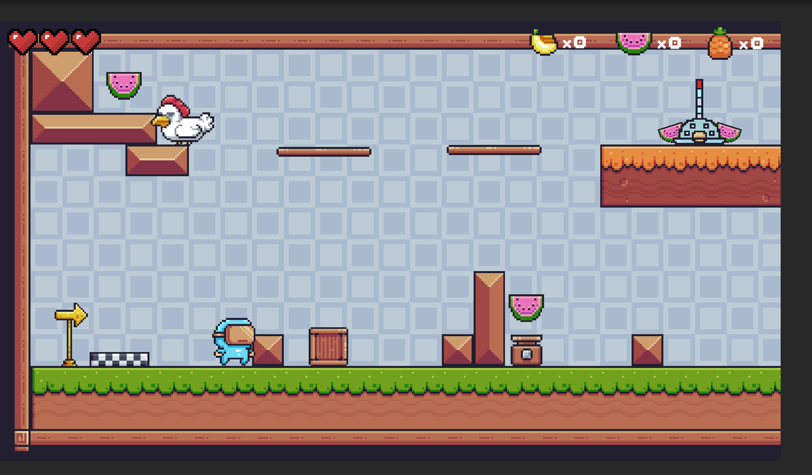

# 🎮 Pixel Adventure - Unity 2D Platformer


## 🌌 Giới thiệu
**Pixel Adventure Unity** là một game **Platformer 2D** được xây dựng bằng Unity.  
Người chơi sẽ điều khiển nhân vật chính vượt qua những thử thách, nhảy qua các platform, thu thập vật phẩm và tránh kẻ thù.  
Dự án mang phong cách **pixel art** cổ điển, đem lại trải nghiệm hoài niệm như các tựa game Mario, Celeste hay Hollow Knight.  

---

## ✨ Tính năng nổi bật
- 🕹️ **Gameplay platformer cổ điển**: di chuyển, nhảy, va chạm.
- 🎨 **Đồ họa Pixel Art**: gọn nhẹ, đẹp mắt, dễ mở rộng.
- 🔊 **Âm thanh & hiệu ứng** sống động.
- 🧩 **Prefab & Scene tổ chức rõ ràng**, thuận tiện cho việc phát triển.
- ⚡ **Tối ưu hiệu suất** để chạy mượt mà trên Unity.

---

## 🛠️ Công nghệ sử dụng
- **Game Engine**: Unity 2022+
- **Ngôn ngữ lập trình**: C#
- **IDE**: Visual Studio / Rider
- **Hệ điều hành hỗ trợ**: Windows, macOS

---

## 🚀 Cách cài đặt & chạy game
1. Clone repository:
   ```bash
   git clone https://github.com/StephenSouth13/Pixel-Adventure-Unity.git
---
## 🧑‍💻 Thông tin sinh viên thực hiện

- Họ tên: Quách Thành Long

- Email: longqt.124010124034@vtc.edu.vn

- Lớp học phần: K24GD-03-2D Game Engine

- Giờ học: 8h30 – 11h30

- Giảng viên hướng dẫn: Thầy Nguyễn Trung Hiếu

---
## 📸 Hình ảnh minh họa
- 