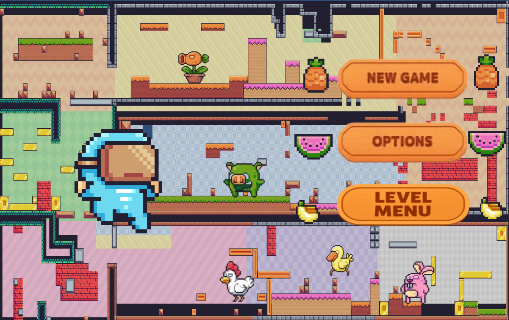
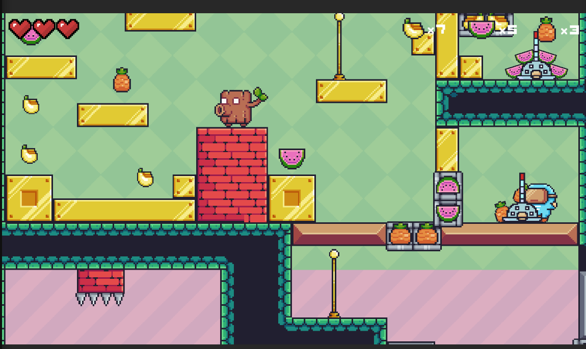

# 🐗 PIXEL_ADVENTURE  

**PIXEL_ADVENTURE** is a **2D platformer** built with **Unity**, where you guide a charming forest creature on a journey through challenging levels.  
Your mission: **collect fruits**, **avoid deadly traps**, **defeat enemies**, and conquer vibrant pixel worlds filled with adventure.  

---

## 📸 Screenshot  
- Home Page:

  

## 🎥 Gameplay Demo

[](https://www.youtube.com/watch?v=DZhKvdBUJM8)  
*Click to watch a short gameplay demo showcasing levels, movement, and pixel art style.*
---

## 🎮 About the Game  

- **Genre:** 2D Platformer / Adventure  
- **Inspired by:** Timeless classics like **Super Mario** and retro pixel art games  
- **Highlights:** Colorful pixel graphics, nostalgic yet engaging gameplay  
- **Experience:** A blend of adventure, action, and item collection  

---
## 🌐 Play Online (WebGL)

You can play **PIXEL_ADVENTURE** instantly in your browser:

🔗 [Play Now on Itch.io](https://quachthanh-long.itch.io/pixel-adventure-unity)

> No installation required — just click the link, wait for the game to load, and enjoy!
---

## 🧑‍💻 Developed By  

- **Name:** Quách Thành Long  
- **Email:** longqt.124010124034@vtc.edu.vn  
- **Course:** K24GD-03-2D Game Engine  
- **Class Time:** 8:30 AM – 11:30 AM  
- **Instructor:** Mr. Nguyễn Trung Hiếu  

---

## 🚀 Key Features  

- 🎨 **Vibrant pixel art** with a retro-inspired style  
- 🕹️ **Simple, intuitive controls** (move, jump, attack)  
- 🍌 **Collectible items** (bananas, watermelons, carrots, etc.) to boost your score  
- ⚔️ **Variety of enemies** and tricky traps to overcome  
- 🔊 **Catchy music & playful sound effects**  
- 📈 **Progressive difficulty**, with each stage more challenging than the last  

---

## 🛠️ Tech Stack  

- **Engine:** Unity 2D  
- **Language:** C#  
- **Graphics Tools:** Sprite Editor / Aseprite  
- **Version Control:** GitHub  

---

## 📦 Installation & Play  

```bash
# Clone this repository
git clone https://github.com/StephenSouth13/Pixel-Adventure-Unity.git

# Open the project in Unity Hub and hit ▶️ Play to start your adventure
